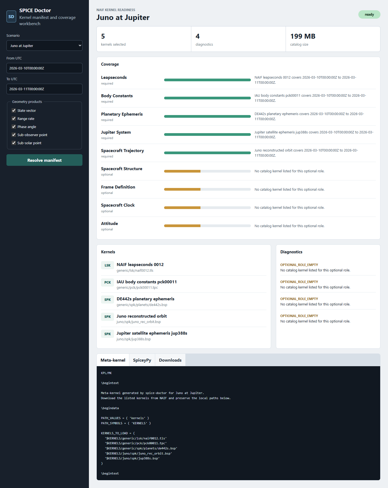

# spice-doctor

SPICE kernel manifest, coverage, and reproducibility workbench for planetary geometry workflows.

`spice-doctor` starts from a mission scenario, a target, an observer, and a UTC range. It selects NAIF kernels from a curated catalog, checks coverage, emits a meta-kernel, and generates a runnable SpiceyPy recipe for common geometry products.



## Current v0

- Zero-dependency JavaScript core library for scenario reports.
- CLI for manifest resolution and reproducible recipe generation.
- Local web app for coverage inspection and handoff reports.
- Curated scenarios for Earth-Moon-Sun, Juno-Jupiter, MRO-Mars, and Cassini-Enceladus 2012.
- Real SPK coverage audit workflow through SpiceyPy.
- Live geometry smoke test for state vectors, range rate, phase angle, and sub-points.

## Use

```bash
node src/cli.js --scenario juno-jupiter \
  --from 2026-03-10T00:00:00Z \
  --to 2026-03-11T00:00:00Z \
  --downloads --meta-kernel --recipe
```

Launch the local workbench:

```bash
node scripts/serve.js
```

## Real SPK coverage audit

The curated catalog can be checked against real SPK coverage with SpiceyPy. Python and SpiceyPy are used for this maintainer workflow.

```bash
python -m venv .venv
.venv/Scripts/python -m pip install -r requirements-spice.txt

.venv/Scripts/python scripts/verify-spk-coverage.py \
  --scenario juno-jupiter \
  --download \
  --max-download-mb 150 \
  --output artifacts/spk-coverage-juno-jupiter.json
```

The verifier downloads missing SPK files into `.spice-kernels/`, reads object IDs and coverage windows through CSPICE, records SHA-256 hashes, and flags catalog coverage windows that are broader than the real kernel coverage.

The v0 catalog has been audited against real SPKs for:

- `de442s.bsp`
- `JUNO/kernels/spk/jup388s.bsp`
- `juno_rec_orbit.bsp`
- `juno_pred_orbit.bsp`
- `MRO/kernels/spk/spk_mar097_050810_531009_p_v1.bsp`
- `mro_psp_rec.bsp`
- `mro_psp.bsp`
- `generic_kernels/spk/satellites/sat441.bsp`
- `CASSINI/kernels/spk/200128RU_SCPSE_12280_12328.bsp`

The Cassini scenario uses `sat441.bsp`, a roughly 631 MB Saturn satellite kernel. Use a higher download cap for that audit:

```bash
.venv/Scripts/python scripts/verify-spk-coverage.py \
  --scenario cassini-enceladus-2012 \
  --download \
  --max-download-mb 700 \
  --output artifacts/spk-coverage-cassini-enceladus-2012.json
```

## Geometry smoke test

Run a live SpiceyPy geometry smoke test after the SPK audit has cached the kernels:

```bash
.venv/Scripts/python scripts/smoke-spice-geometry.py \
  --scenario juno-jupiter \
  --download \
  --max-download-mb 150 \
  --output artifacts/spice-geometry-juno-jupiter.json
```

The smoke test resolves the scenario through the CLI, loads the selected kernels with CSPICE, and computes a state vector, range rate, phase angle, sub-observer point, and sub-solar point at the midpoint of the requested window.

## API

```js
import { buildManifestReport } from 'spice-doctor';

const report = buildManifestReport({
  scenarioId: 'cassini-enceladus-2012',
  window: {
    start: '2012-10-19T08:00:00Z',
    stop: '2012-10-19T10:00:00Z',
  },
});

console.log(report.status);
console.log(report.metaKernel);
console.log(report.spiceypyRecipe);
```

## Why this helps

SPICE geometry work often starts with a deceptively practical question: which kernels do I need for this observer, target, and time range? The answer depends on ephemerides, leapseconds, body constants, spacecraft trajectory kernels, and the coverage windows inside those files.

`spice-doctor` makes that setup explicit. A generated report shows the selected kernels, coverage readiness, download sources, a meta-kernel, and a short Python recipe that can be checked against native SPICE or WebGeocalc.

## Sources for the v0 catalog

- NAIF generic kernels: https://naif.jpl.nasa.gov/pub/naif/generic_kernels/
- Juno mission kernels: https://naif.jpl.nasa.gov/pub/naif/JUNO/kernels/
- MRO mission kernels: https://naif.jpl.nasa.gov/pub/naif/MRO/kernels/
- Cassini mission kernels: https://naif.jpl.nasa.gov/pub/naif/CASSINI/kernels/
- SPICE Toolkit documentation: https://naif.jpl.nasa.gov/naif/toolkit.html
- WebGeocalc: https://naif.jpl.nasa.gov/naif/webgeocalc.html
- SpiceyPy: https://github.com/AndrewAnnex/SpiceyPy

## License

MIT
